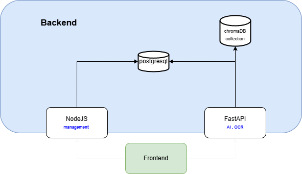
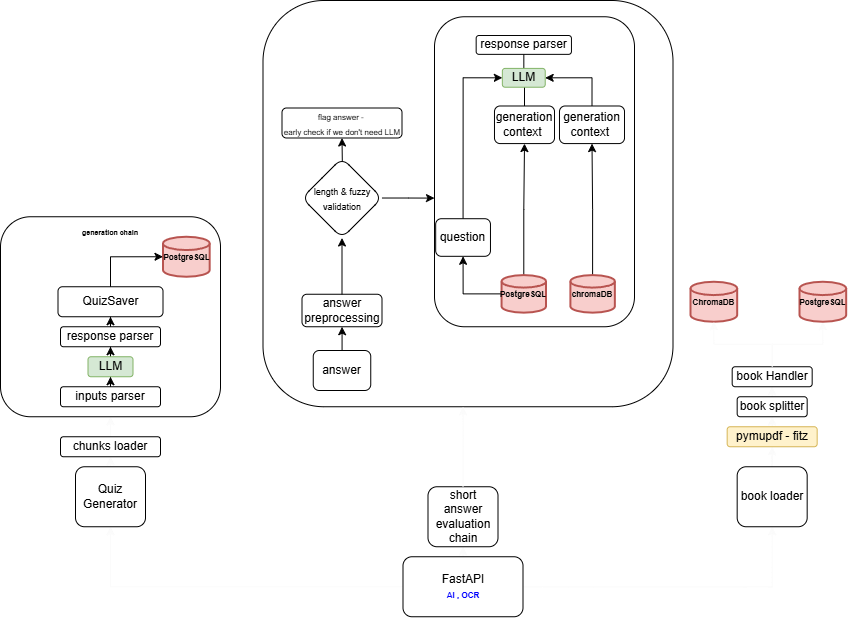
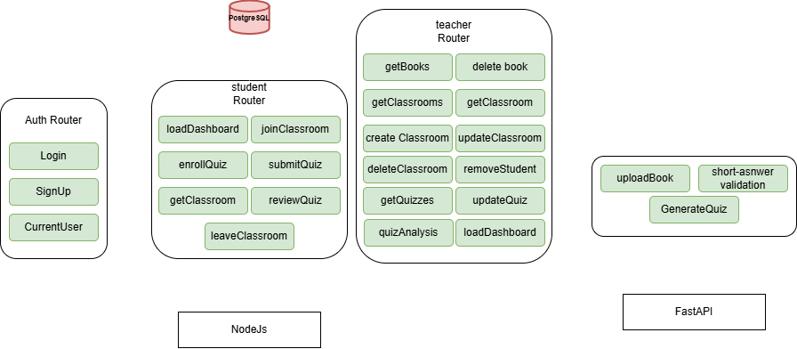

# System Architecture

This document outlines the high-level architecture of the AI Quiz Generator & Proctoring System, detailing the components, data flow, and interactions.

---

## 1. Overview Diagram

*Description:*  
Shows the main components and their interactions:  
- FastAPI service 
- Nodejs service 
- Database (PostgreSQL)  
- VectorDB (ChromaDB)  
- LLM Provider (Hugging Face/Gemini)  
- Cheat Detection Module (MediaPipe integration)  

## 2. FastAPI service

🔍 Key Components:
## Book Loader

Uses pymupdf (fitz) to extract content from uploaded books.

Content is passed to the book splitter for chunking and semantic embedding.

Stores processed content in ChromaDB for semantic retreival and chunks in PostgreSQL for range retreival.
(note : I didn't use only chromaDB as it won't be ideal in range retreival insteead we optimized postgreesql with indexing and chunks table partitioning by book)

## Quiz Generator

Loads content chunks from postgresql.

Passes them through a generation chain: inputs parser → LLM → response parser → QuizSaver.

Saves generated questions / answers / generation context (for short-answer questions) to PostgreSQL.

## Short-Answer questions Evaluation Chain

Answer preprocessing performs early checks (length, fuzzy matching).

if check passed , the system uses an LLM to evaluate the answer in the context of the stored generation data.

Data from PostgreSQL (generation context) and ChromaDB (similar context in the book) is used to provide generation context for accurate assessment.

## Storage

PostgreSQL: Stores quiz data, evaluation metadata, and user input.

ChromaDB: Holds vectorized content chunks for context retrieval.

## 🔄 Flow Summary:
Book Input → Chunking & Embedding → Quiz Generation → Quiz Storage

Answer Input → Preprocessing → Context Retrieval → LLM Evaluation → Response

## 2. NodeJs service

### 🛡️ Auth Router (Node.js)
Handles all authentication-related operations:

- `Login`: Authenticates users.
- `SignUp`: Registers new users.
- `CurrentUser`: Fetches authenticated user information.

---

### 🎓 Student Router (Node.js)
Provides endpoints specific to student interactions:

- `loadDashboard`: Load personalized student dashboard.
- `enrollQuiz`: Enroll in a quiz.
- `getClassroom`: Retrieve classroom data.
- `joinClassroom`: Join a classroom using a code.
- `submitQuiz`: Submit answers for a quiz.
- `reviewQuiz`: Review attempted quizzes and feedback.
- `leaveClassroom`: Leave a joined classroom.

---

### 🧑‍🏫 Teacher Router (Node.js)
Offers features to manage classrooms, quizzes, and students:

- `getBooks`: Fetch list of uploaded books.
- `deleteBook`: Remove an uploaded book.
- `getClassrooms`: List all classrooms managed by the teacher.
- `createClassroom`: Create a new classroom.
- `deleteClassroom`: Remove an existing classroom.
- `getClassroom`: Retrieve specific classroom data.
- `updateClassroom`: Update classroom information.
- `removeStudent`: Remove a student from a classroom.
- `getQuizzes`: List quizzes created by the teacher.
- `updateQuiz`: Modify an existing quiz.
- `quizAnalysis`: Analyze quiz performance and metrics.
- `loadDashboard`: Load personalized teacher dashboard.

---
 
